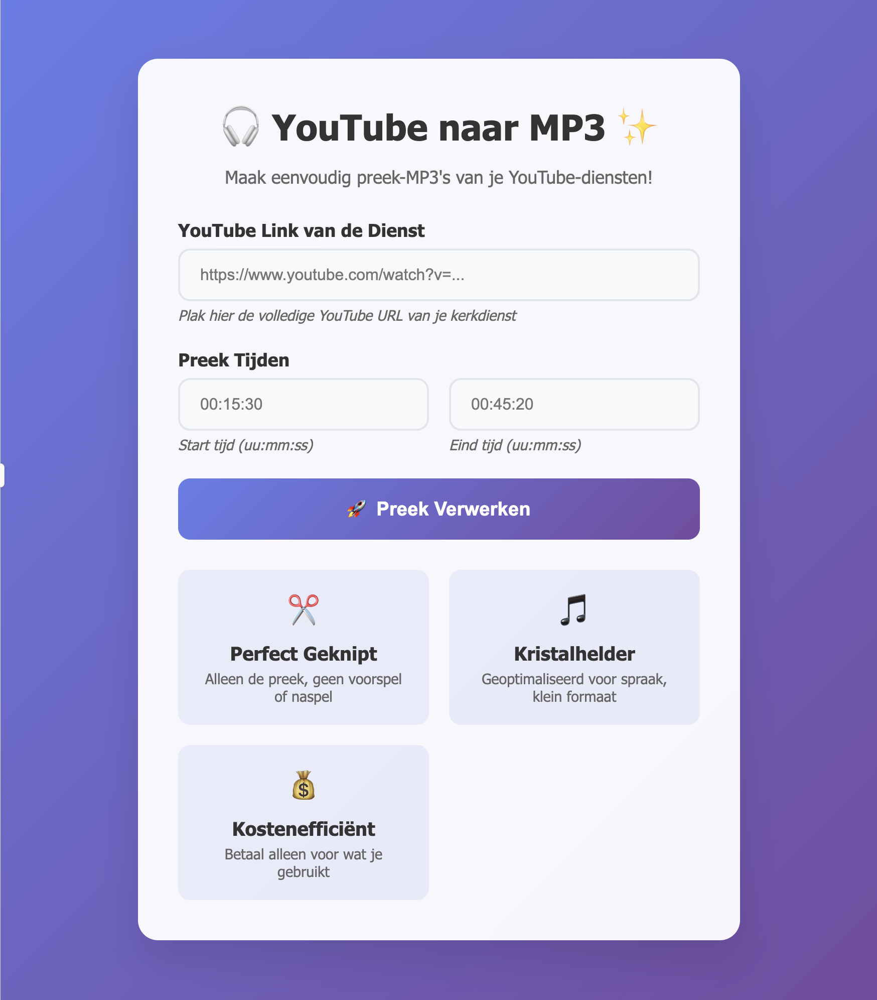
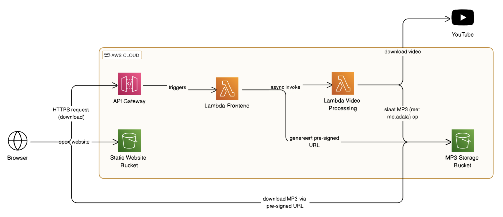

# YouTube naar MP3 Preek Converter

Een kosteneffectieve, serverless AWS-oplossing om preken uit YouTube-video's automatisch te extraheren als MP3-bestanden via een eenvoudige webinterface.

## 🎯 Projectdoel

Deze applicatie maakt het mogelijk om moeiteloos preek-audio uit zondagsdienst YouTube-video's te extraheren door simpelweg een YouTube-link en timestamps in te voeren. Perfect voor kerkgemeenschappen die hun preken willen archiveren en delen.

## ✨ Functies

- 🎵 **Audio Extractie**: Converteer YouTube-video's naar kristalheldere MP3-bestanden
- ✂️ **Precisie Knippen**: Specificeer exact start- en eindtijd van de preek
- 💻 **Eenvoudige Interface**: Gebruikersvriendelijke webinterface, geen technische kennis vereist
- 💰 **Kostenefficiënt**: Serverless AWS-architectuur - betaal alleen voor gebruik
- 🧹 **Auto Cleanup**: MP3-bestanden worden automatisch na 24 uur verwijderd
- 🛠️ **Minimaal Onderhoud**: Volledig beheerd via Infrastructure as Code (AWS SAM)



## 🏗️ Architectuur

### AWS Services
- **AWS Lambda**: Video processing en API logica (Python)
- **API Gateway**: RESTful API endpoints
- **S3**: Opslag voor MP3-bestanden en static website hosting
- **CloudWatch**: Logging en monitoring
- **IAM**: Security en toegangsbeheer



### Tech Stack
- **Backend**: Python 3.9+
- **Frontend**: HTML, CSS, JavaScript (vanilla)
- **Audio Processing**: FFmpeg, yt-dlp
- **Infrastructure**: AWS SAM (Infrastructure as Code)

## 📋 Vereisten

### Development Environment
- macOS (MacBook Pro)
- Visual Studio Code
- Python 3.9+
- Node.js 18+ (voor AWS SAM CLI)
- Git

### AWS Requirements
- AWS Account
- AWS CLI geïnstalleerd en geconfigureerd
- AWS SAM CLI geïnstalleerd

### Installatie Development Tools

```bash
# AWS CLI installeren (via Homebrew)
brew install awscli

# AWS SAM CLI installeren
brew tap aws/tap
brew install aws-sam-cli

# Verificatie
aws --version
sam --version
```

## 🚀 Quick Start

### 1. Repository Clonen

```bash
git clone https://github.com/[jouw-username]/preek-mp3-converter.git
cd preek-mp3-converter
```

### 2. Python Omgeving Opzetten

```bash
# Virtual environment aanmaken
python3 -m venv venv
source venv/bin/activate

# Dependencies installeren
pip install -r requirements.txt
```

### 3. AWS Configuratie

```bash
# AWS credentials configureren
aws configure

# Verificeer toegang
aws sts get-caller-identity
```

### 4. Lokale Development

```bash
# SAM applicatie bouwen
sam build

# Lokaal testen
sam local start-api

# In browser openen: http://localhost:3000
```

### 5. Deployment naar AWS

```bash
# Eerste deployment (interactief)
sam deploy --guided

# Volgende deployments
sam deploy
```

## 📁 Project Structuur

```
preek-mp3-converter/
├── README.md
├── template.yaml                 # SAM Infrastructure template
├── requirements.txt             # Python dependencies
├── src/
│   ├── video_processor/        # Video processing Lambda
│   │   ├── app.py
│   │   └── requirements.txtaw
│   ├── frontend_logic/         # API Gateway handler Lambda
│   │   ├── app.py
│   │   └── requirements.txt
│   └── status_checker/         # Status checking Lambda
│       ├── app.py
│       └── requirements.txt
├── web/                        # Frontend bestanden
│   ├── index.html
│   ├── style.css
│   └── script.js
├── layers/                     # Lambda layers (FFmpeg, yt-dlp)
├── tests/                      # Unit en integratie tests
└── docs/                       # Aanvullende documentatie
```

## 🔧 Configuratie

### Environment Variables

De volgende environment variabelen worden automatisch ingesteld via SAM:

- `MP3_BUCKET_NAME`: S3 bucket voor MP3 opslag
- `WEBSITE_BUCKET_NAME`: S3 bucket voor static website
- `API_GATEWAY_URL`: API Gateway endpoint URL

### S3 Lifecycle Policy

MP3-bestanden worden automatisch na 24 uur verwijderd via een S3 Lifecycle Policy die is geconfigureerd in de SAM template.

## 🧪 Testen

### Lokaal Testen

```bash
# Unit tests
python -m pytest tests/

# Lokale API testen
sam local start-api
curl -X POST http://localhost:3000/process -d '{"youtube_url": "...", "start_time": "00:10:00", "end_time": "00:45:00"}'
```

### Integration Testing

```bash
# End-to-end test na deployment
python tests/integration_test.py
```

## 📖 Gebruik

1. **Open de webinterface** via de URL die na deployment wordt getoond
2. **Plak YouTube URL** van de kerkdienst
3. **Voer timestamps in** (formaat: HH:MM:SS)
   - Start tijd: wanneer de preek begint
   - Eind tijd: wanneer de preek eindigt
4. **Klik "Verwerken"** en wacht op de status updates
5. **Download je MP3** wanneer de verwerking is voltooid

## 🔐 Security

- Alle AWS resources volgen het principe van least privilege
- S3 buckets zijn niet publiek toegankelijk (behalve website bucket)
- API Gateway endpoints zijn beschermd tegen misbruik
- Automatische cleanup voorkomt onnodig dataopslag

## 💰 Kosten Optimalisatie

- **Lambda**: Alleen betalen voor daadwerkelijke uitvoeringstijd
- **S3**: Automatische cleanup na 24 uur
- **API Gateway**: Pay-per-request model
- **Geschatte kosten**: €2-5 per maand voor typisch kerkgebruik

## 🛠️ Onderhoud

### Updates Deployen

```bash
# Code wijzigingen
git add .
git commit -m "Beschrijving van wijzigingen"
git push

# Deployment
sam build
sam deploy
```

### Logs Bekijken

```bash
# CloudWatch logs bekijken
sam logs -n VideoProcessorFunction --stack-name preek-mp3-converter --tail

# Specifieke Lambda functie logs
aws logs tail /aws/lambda/preek-mp3-converter-VideoProcessorFunction
```

### Monitoring

- CloudWatch Dashboards zijn beschikbaar in de AWS Console
- Lambda error rates en execution times worden automatisch gemonitord
- S3 storage gebruik wordt bijgehouden

## 🐛 Troubleshooting

### Veelvoorkomende Problemen

**Lambda Timeout**
- Verhoog timeout in `template.yaml`
- Check video lengte en processing tijd

**FFmpeg Errors**
- Verificeer Lambda layer configuratie
- Check CloudWatch logs voor specifieke errors

**S3 Upload Failures**
- Controleer IAM permissions
- Verificeer bucket configuratie

**YouTube Download Errors**
- Sommige video's kunnen beschermd zijn
- Check yt-dlp versie in Lambda layer

## 🤝 Contributing

1. Fork het project
2. Maak een feature branch (`git checkout -b feature/AmazingFeature`)
3. Commit je wijzigingen (`git commit -m 'Add some AmazingFeature'`)
4. Push naar de branch (`git push origin feature/AmazingFeature`)
5. Open een Pull Request

## 📝 Sprint Planning

Het project is opgezet volgens Agile/Scrum principes:

- **Sprint 0**: Basis setup & kernfunctionaliteit
- **Sprint 1**: Web interface & API koppeling  
- **Sprint 2**: MP3 download & status feedback
- **Sprint 3**: Automated cleanup & UX verbeteringen
- **Sprint 4**: Infrastructure as Code (AWS SAM)
- **Sprint 5**: Testen, documentatie & deployment

Zie het projectplan document voor gedetailleerde sprint beschrijvingen.

## 📄 Licentie

Dit project is gelicenseerd onder de MIT License - zie het [LICENSE](LICENSE) bestand voor details.

## 🙏 Acknowledgments

- Ontwikkeld voor kerkgemeenschappen om preek archivering te vereenvoudigen
- Gebouwd met open source tools: yt-dlp, FFmpeg
- Powered by AWS serverless technologie

---

**Vragen of problemen?** Open een issue in de GitHub repository of neem contact op met de project maintainers.